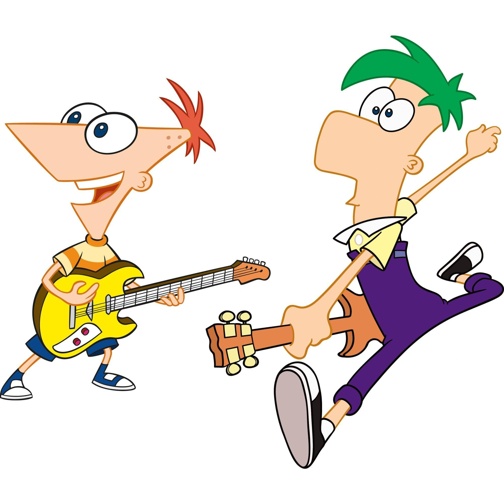

<h1 align="center">
          Ferb Latin Converter 🏡
</h1>

 

<h3 align="center">
          Live Project : https://ferblatinconverter.netlify.app/
</h3>
 

What is Ferb Latin Converter? 🤔
During their routine summer fun, the two brothers Phineas and Ferb(in a Dinsney series) create their own language,
 Ferb Latin which quickly catches on. To speak it you must take the first letter of every word, move it to the end, and then say '-erb'\; though two-letter words stay the same. 

  

